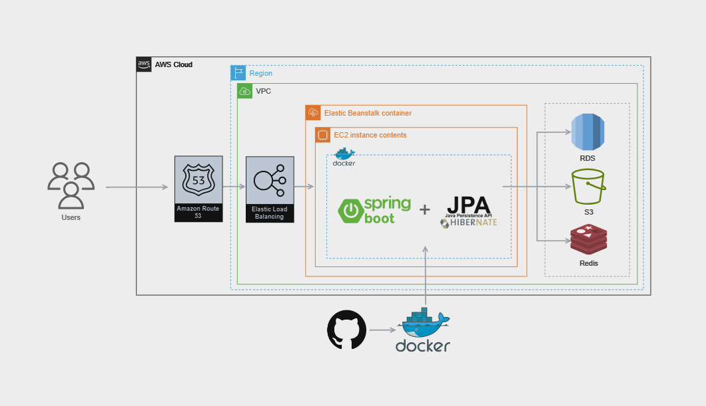
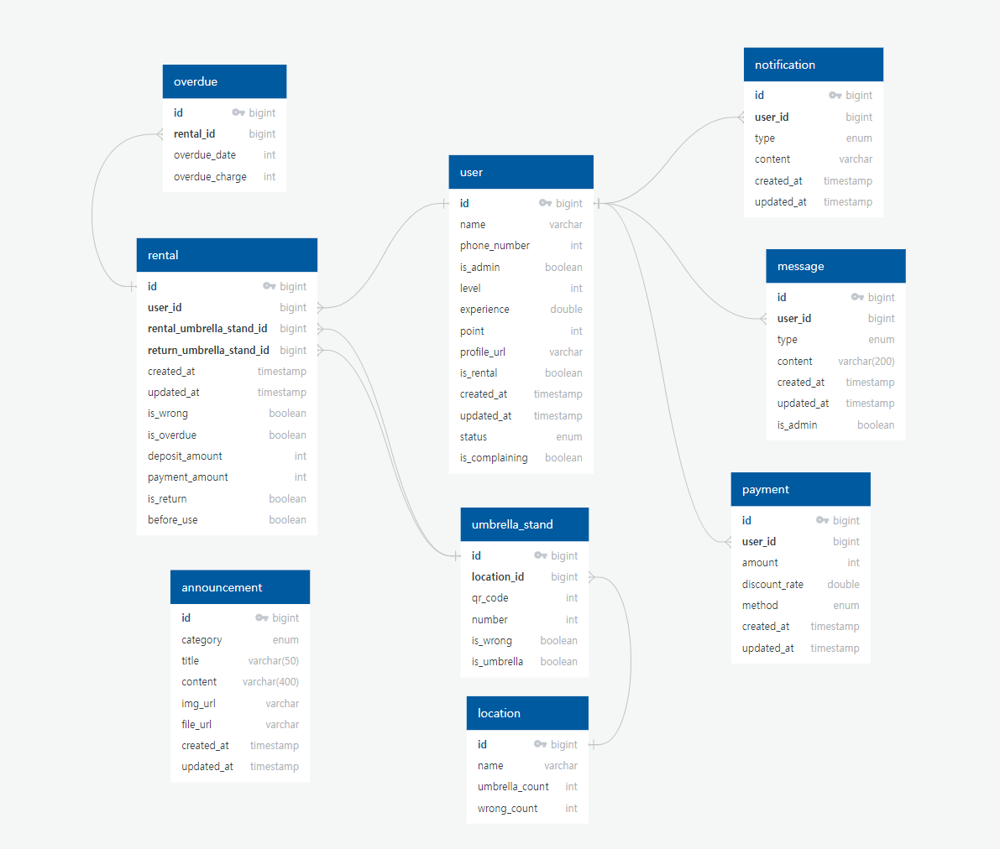
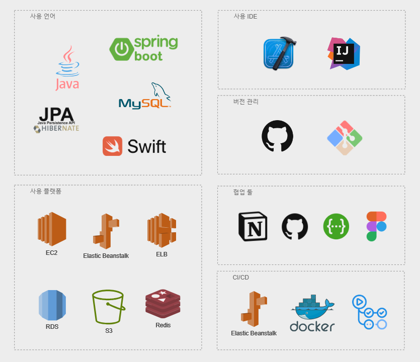

# Cloud Project - mulmagi/server

---------------------------
## Project Introduction

### ☔물막이 - QR 코드로 간편한 우산 대여 서비스

갑작스러운 비에 우산이 없어 당황한 적이 있나요?:sweat_smile:

그런 당신을 위해 **우산을 간편하게 빌릴 수 있는 서비스**를 제공합니다.:wink:

손은 가볍게 옷은 뽀송하게 지켜보아요!🥰

---------------------------
## Architecture Diagram

---------------------------

## ERD Diagram

   
---------------------------

## Collaboration Tool

- swagger - [Swagger Documentation](http://localhost:8080/swagger-ui/index.html#/)

- Figma - [Figma Design](https://www.figma.com/file/T9cbZSQslVkdP1zqeV0W9k/%ED%81%B4%EB%9D%BC%EC%9A%B0%EB%93%9C%ED%94%84%EB%A1%9C%EC%A0%9D%ED%8A%B8?type=design&node-id=1-3&mode=design&t=0s8Hqg2p9CXWEgH2-0)

- notion - [Notion Documentation](https://www.notion.so/4cac06524460471db2b7bed58c03266a)

---------------------------

## Member
- [김가영](https://github.com/yonding)
- [박재윤](https://github.com/qkrwodsbfjq)
- [유승근](https://github.com/yuseunggeun)
- [최유정](https://github.com/eqvyoo)
- [최은지](https://github.com/ejalice)

---------------------------

## Commit Convention
| 태그이름    | 내용         |
|---------|------------|
| `Feat`  | 새로운 기능 (파일 추가도 포함)을 추가할 경우|
| `Fix `  | 버그를 고친 경우|
| `Update` | 코드 수정을 한 경우 
| `!HOTFIX` | 급하게 치명적인 버그를 고쳐야하는 경우|
| `Style`   |  코드 포맷 변경, 세미 콜론 누락, 코드 수정이 없는 경우|
| `Refactor` | 프로덕션 코드 리팩토링|
| `Comment` | 필요한 주석 추가 및 변경|
| `Docs`	   |  문서를 수정한 경우|
| `Test`    |테스트 추가, 테스트 리팩토링(프로덕션 코드 변경 X)|
| `Chore`	  | 빌드 태스트 업데이트, 패키지 매니저를 설정하는 경우(프로덕션 코드 변경 X)|
| `Rename`  |파일 혹은 폴더명을 수정하거나 옮기는 작업만인 경우|
| `Remove`  | 파일을 삭제하는 작업만 수행한 경우|
 

1. issue 등록
2. 로컬 git에서 main으로 브랜치 이동 후 pull로 메인 최신화
3. issue/번호로 브랜치 만들고 push
4. pull request 보내고 코드 리뷰자, 작성자 선택
5. 코드 리뷰 후 merge
